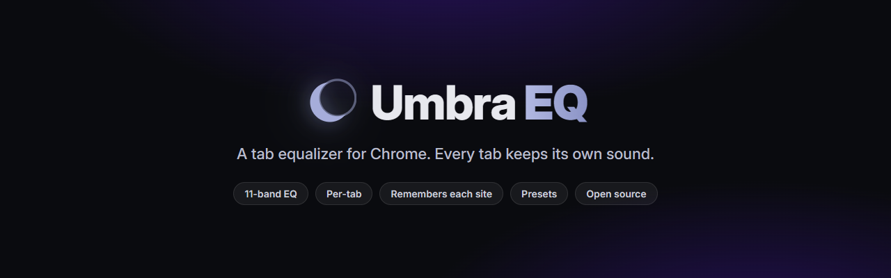
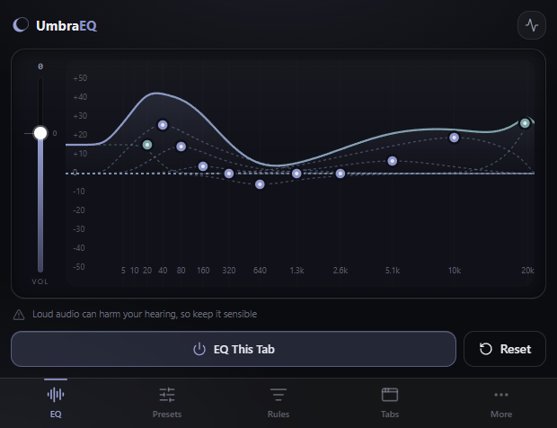
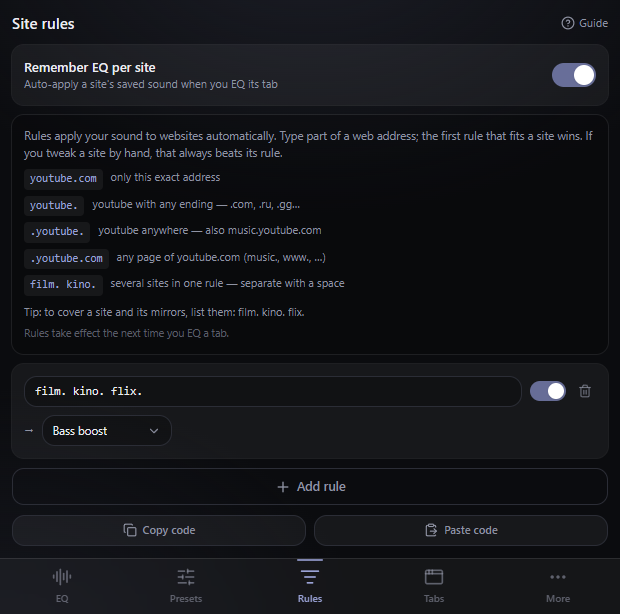
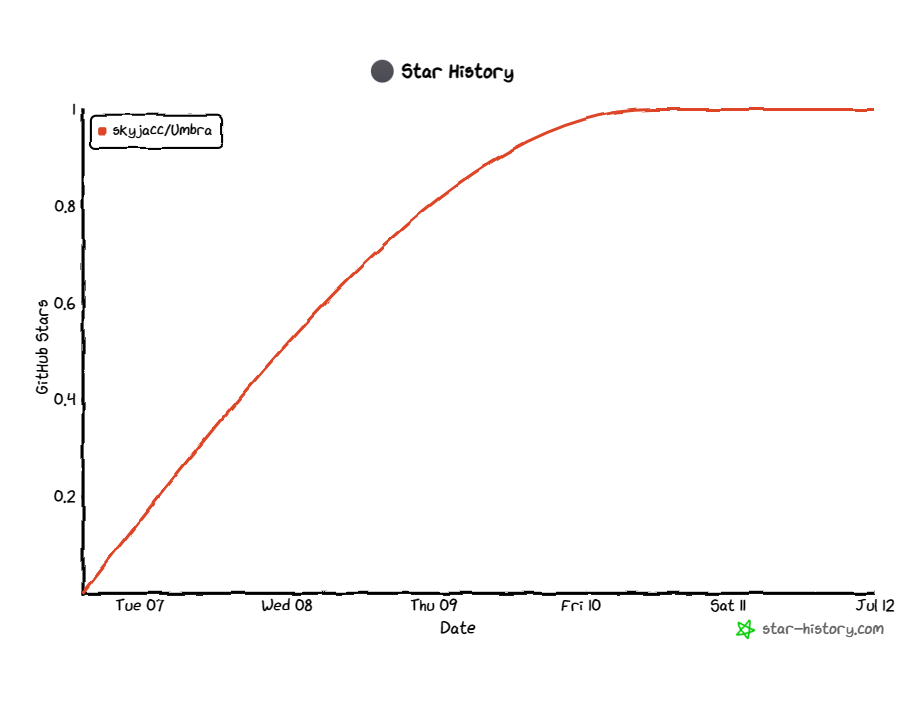

<p align="center">
  <a href="https://github.com/skyjacc/Umbra/releases/latest"></a>
</p>

<h1 align="center">Umbra EQ</h1>

<p align="center">
  <b>Per-tab parametric EQ + bass boost for Chrome, Edge & Opera</b><br>
  11 bands &middot; one global sound &middot; site rules &middot; 100% local
</p>

<p align="center">
  <a href="https://github.com/skyjacc/Umbra/releases/latest"></a>
  <a href="LICENSE"></a>
  <a href="https://github.com/skyjacc/Umbra/actions/workflows/build.yml"></a>
  <a href="https://github.com/skyjacc/Umbra/stargazers"></a>
  <a href="https://github.com/skyjacc/Umbra/commits"></a>
  
  
</p>

<p align="center">
  <a href="https://github.com/skyjacc/Umbra/releases/latest"></a>
  &nbsp;
  <a href="README.ru.md"></a>
</p>

<p align="center">
  A free and open-source tab equalizer for Chrome, Edge, and Opera.<br>
  Boost the bass, fix harsh audio, or make a quiet video louder — and hear the change while you drag.
</p>

<!--
  DEMO GIF PENDING RECORDING.
  Record ~10-15s of the popup on a tab that is playing audio: drag the response curve across a few
  bands, apply the Bass Boost preset, then add a site rule. Optimize to < 5 MB (ScreenToGif / ShareX),
  save as docs/demo.gif, and uncomment the line below. Until then the two static screenshots are the fallback.
-->
<!-- <p align="center"></p> -->

<p align="center">
  
  &nbsp;
  
</p>

## Contents

- [Why Umbra EQ](#why-umbra-eq)
- [Install](#install)
- [Features](#features)
- [How to use](#how-to-use)
- [Browser support](#browser-support)
- [Build from source](#build-from-source)
- [How it works](#how-it-works)
- [Privacy](#privacy)
- [Stack](#stack)
- [Stars](#stars)
- [Feedback](#feedback)
- [Contributing](#contributing)
- [Credits and licenses](#credits-and-licenses)

## Why Umbra EQ

Browser audio is take-it-or-leave-it: thin bass on laptop speakers, one video mixed too quiet, another with harsh highs — and most EQ extensions go silent on the streaming sites you actually use. Umbra fixes the sound of the tab you're listening to, live, and keeps it 100% on your computer. Set it once for every tab, or give specific sites their own sound with rules.

## Install

The Chrome Web Store listing is on the way. Until then it installs in about a minute:

1. Grab the latest `umbra-eq-<version>.zip` from [Releases](https://github.com/skyjacc/Umbra/releases/latest) and unzip it, or build from source (see below).
2. Open `chrome://extensions` (or `edge://extensions`, `opera://extensions`) and turn on **Developer mode**.
3. Click **Load unpacked** and pick the unzipped folder (the `dist` folder if you built it). Chrome 116 or newer.

> [!NOTE]
> If the icon does nothing after loading, make sure you selected the **`dist`** folder (the build output), not the repo root, and that you are on Chrome 116+. Umbra's audio engine needs the offscreen-document API, which older builds lack.

## Features

- **11-band parametric EQ** — drag the curve to boost or cut any frequency, live.
- **One global sound + site rules** — one EQ everywhere, or per-site overrides by address pattern (first match wins). Each tab keeps its own chain, so two tabs can sound different.
- **Works on Netflix, Spotify** and other sites where EQ extensions go silent.
- **Bass boost, volume past 100%, output limiter** — big boosts stay clean, no clipping.
- **Presets** — Bass Boost / Vocal / Movie / Warm + your own; export as a file or a copy-paste share code.
- **Live spectrum, band guide, full-window editor.**
- **Keyboard + screen-reader friendly**, RU/EN, four themes. 100% local — no account, no network, no analytics.

## How to use

1. Play audio in a tab, click the Umbra EQ icon, press **EQ This Tab**.
2. Drag a dot (or use the arrow keys): left/right is frequency, up/down is boost/cut; Shift changes width/Q, double-click resets. The left strip is master volume.
3. Add a **rule** like `youtube.` to give a site its own sound; stop a tab under **Tabs**, or open **Full window** to edit the global sound on a bigger graph.

The in-app **Guide** (More tab) walks through all of it, in Russian or English.

## Browser support

| Browser | Status | Notes |
| ------- | ------ | ----- |
| **Chrome** | Supported | Chrome 116+ (offscreen document + tab capture) |
| **Edge** | Supported | Chromium, same package |
| **Opera** | Supported | Chromium, same package |
| **Firefox** | Planned | Needs a separate content-script engine (Firefox has no `tabCapture`/`offscreen`). See [`FIREFOX_PORT.md`](FIREFOX_PORT.md). |

## Build from source

<details>
<summary><b>For developers</b></summary>

The popup is a React and TypeScript app bundled with Vite and [CRXJS](https://crxjs.dev). The audio engine (service worker plus an offscreen Web Audio document) stays vanilla.

```bash
npm install
npm run build      # → dist/  (the loadable, CSP-clean MV3 extension)
npm run dev        # HMR dev build
npm test           # 64 Vitest unit tests for the audio, preset, rule + invariant logic
npm run typecheck  # tsc, also runs in CI
```

Then load the **`dist`** folder unpacked (see [Install](#install)).

To build the uploadable store zip:

```bash
npm run build
powershell -ExecutionPolicy Bypass -File build-zip.ps1
# → release/umbra-eq-<version>.zip
```

The same zip is accepted by the Chrome Web Store, Microsoft Edge Add-ons, and Opera.

> Dev loop: `npm run build` → **Reload** on the extension card → Ctrl+R the popup or full-window page.
> After a `vite dev` run, delete `node_modules/.vite` and `dist` before a real build, or `dist/` stays a dev-mode stub.

</details>

## How it works

Manifest V3. The **popup** (React + TypeScript) is the source of truth: it resolves each tab (rule → global profile → flat) and pushes the bands to the engine. The **engine is vanilla** — the service worker owns the offscreen document and mints tab-capture ids; the offscreen document holds a chain of 11 biquad filters per tab behind a brick-wall limiter, glided click-free. Pure audio/preset/rule math lives in `src/lib` (unit-tested); strict CSP, no remote code, no `eval`.

See [`PROJECT.md`](PROJECT.md) for the full architecture and [`CONTRIBUTING.md`](CONTRIBUTING.md) to contribute.

## Privacy

100% local — no network requests, no analytics; your audio is never recorded or sent, and settings/presets stay in your browser. Details in [`PRIVACY.md`](PRIVACY.md).

## Stack

| Layer | Technology |
| ----- | ---------- |
| Shell | Manifest V3 — service worker + offscreen document |
| Audio | Web Audio API — 11 biquad filters per tab + brick-wall limiter |
| Popup | React 18, TypeScript |
| Build | Vite + CRXJS |
| UI | Tailwind CSS, shadcn/ui, lucide icons |
| Tests | Vitest (64) |
| CI/CD | GitHub Actions — builds the `dist/` zip on push, PR & `v*` tags |

## Stars

If Umbra fixed your sound, a star helps other people find it.

<p align="center">
  <a href="https://github.com/skyjacc/Umbra/stargazers"></a>
  &nbsp;
  <a href="https://github.com/skyjacc/Umbra/releases"></a>
</p>

<p align="center">
  <a href="https://star-history.com/#skyjacc/Umbra&Date"></a>
</p>

## Feedback

| | |
| --- | --- |
| Suggest a feature | [Start a discussion](https://github.com/skyjacc/Umbra/discussions) |
| Something broke? | [File an issue](https://github.com/skyjacc/Umbra/issues/new) |
| Like it? | [Star the repo](https://github.com/skyjacc/Umbra/stargazers) — it really helps |

## Contributing

Issues and pull requests are welcome. See [`CONTRIBUTING.md`](CONTRIBUTING.md), or open an issue at <https://github.com/skyjacc/Umbra/issues>.

## Credits and licenses

- Application code: **MIT**, see [`LICENSE`](LICENSE).
- Fonts: **Inter** and **Geist Mono** under the SIL Open Font License 1.1 ([`public/fonts/OFL-Inter.txt`](public/fonts/OFL-Inter.txt), [`public/fonts/OFL-GeistMono.txt`](public/fonts/OFL-GeistMono.txt)).
- UI: **React**, **Tailwind CSS**, **shadcn/ui** (MIT), **lucide-react** icons (ISC).
- Full third-party attributions: [`THIRD-PARTY-NOTICES.md`](THIRD-PARTY-NOTICES.md).

Umbra EQ is an independent audio tool. It is not affiliated with, endorsed by, or connected to Netflix, Spotify, YouTube, Google, or any site it processes audio on. All trademarks belong to their respective owners.

<p align="center">
  <code>chrome equalizer</code> &middot; <code>browser eq</code> &middot; <code>bass boost chrome</code> &middot; <code>parametric equalizer extension</code> &middot; <code>per-tab equalizer</code> &middot; <code>netflix equalizer</code> &middot; <code>spotify equalizer</code> &middot; <code>manifest v3 equalizer</code> &middot; <code>эквалайзер для браузера</code> &middot; <code>усиление баса</code>
</p>

<p align="center">
  <a href="https://github.com/skyjacc/Umbra/releases/latest"></a>
</p>