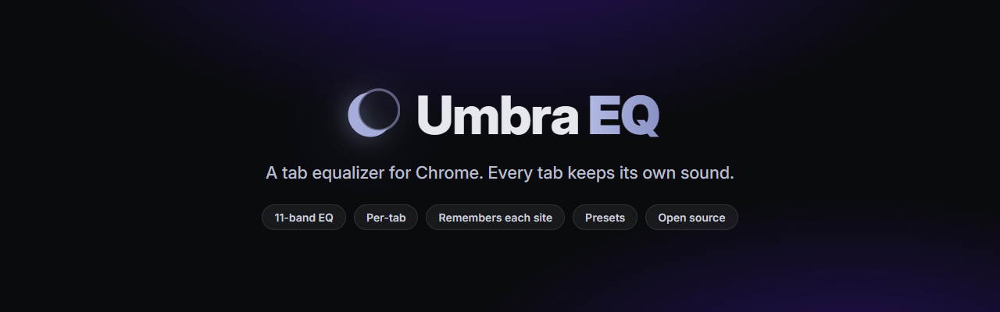
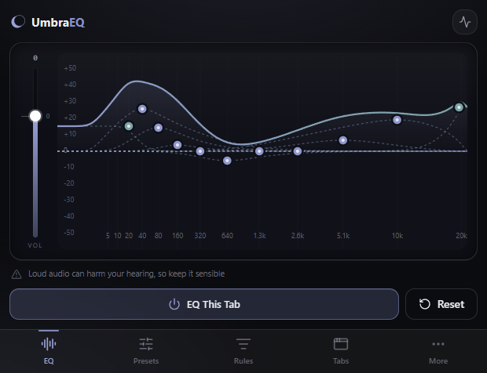
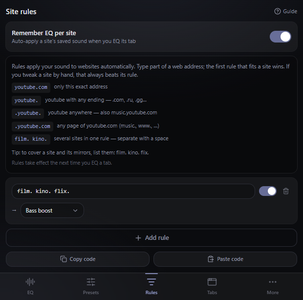

<p align="center">
  <a href="https://github.com/skyjacc/Umbra/releases/latest"></a>
</p>

<h1 align="center">Umbra EQ</h1>

<p align="center">
  <b>Per-tab parametric equalizer, bass boost & volume booster for Chrome, Edge & Opera</b><br>
  11 bands &middot; one global sound &middot; site rules &middot; 100% local
</p>

<p align="center">
  <a href="https://chromewebstore.google.com/detail/plkncppcgglcjdkmcdeajhbfccbnnoee"></a>
  <a href="https://chromewebstore.google.com/detail/plkncppcgglcjdkmcdeajhbfccbnnoee"></a>
  <a href="LICENSE"></a>
  <a href="https://github.com/skyjacc/Umbra/actions/workflows/build.yml"></a>
  
  
</p>

<p align="center">
  <a href="https://chromewebstore.google.com/detail/plkncppcgglcjdkmcdeajhbfccbnnoee"></a>
  &nbsp;
  <a href="README.ru.md"></a>
</p>

<p align="center">
  
  &nbsp;
  
</p>

## Why Umbra EQ

Thin bass on laptop speakers, one video mixed too quiet, another too harsh — and most EQ extensions go silent on the streaming sites you actually use. Umbra fixes the sound of the tab you're listening to, live, and keeps it 100% on your computer. Set one sound for every tab, or give specific sites their own with rules.

## What it does

- **11-band parametric EQ** — drag the curve to boost or cut any frequency, live. Or type the
  numbers: every band's frequency, gain and Q can be entered by hand.
- **Per-site profiles** — keep your everyday sound everywhere, then give individual sites their
  own. YouTube can have one curve and Spotify another while the global profile stays untouched.
  Rules match by address pattern, first match wins, and each tab keeps its own filter chain.
- **Save for this site** — turn the sound you are hearing into a rule for the site you are on,
  without changing how everything else sounds.
- **Reset** — put the sound back to what it was when you opened Umbra. Not one step back; all the
  way back.
- **Bypass** — hear the tab unshaped while the curve stays editable, then switch back to compare.
  Nothing is saved until you leave Bypass.
- **Presets you can build on** — Bass Boost / Vocal / Movie / Warm, plus your own. Nudge a band and
  the header keeps saying *Based on Vocal*, so a tweaked preset never becomes an anonymous curve.
- **Auto Gain** *(off by default)* — level-matches the tab so you judge the curve and not the
  loudness.
- **Peak meter** — shows the signal after the EQ and your volume, so clipping is visible instead of
  guessed.
- **Works on Netflix, Spotify** and other sites where EQ extensions go silent.
- **Bass boost, volume past 100%, output limiter** — big boosts stay clean.
- **Live spectrum, band guide, full-window editor.**
- **Keyboard and screen-reader friendly**, RU/EN, four themes and a custom accent colour. No
  account, no network, no analytics.

## How to use

1. Play audio in a tab, click the Umbra EQ icon, press **EQ This Tab**.
2. Drag a dot on the curve: left/right is frequency, up/down is boost or cut. The strip on the left
   is master volume.
3. Prefer the keyboard? Focus a dot and use the arrows — **Shift** for a bigger step, **Alt** for a
   finer one. Or Tab into the row under the graph and type the frequency, gain and Q directly.
4. Press **Save for {site}** to keep this sound for the site you are on, **⟲** to put it back, or
   **Bypass** to hear the tab untouched for a moment.

The in-app **Guide** (More tab) walks through all of it, in Russian or English.

<!-- SCREENSHOT WANTED — docs/screenshot-precision.png
     The band row under the graph with a value being typed: "Band 5 · 437 Hz · -19.7 dB · Q 0.71",
     and the header reading "Based on Vocal". Shows the tool is precise, not just pretty.
     Add the file, then uncomment:
<p align="center"></p>
-->

<!-- SCREENSHOT WANTED — docs/screenshot-bypass.png
     Bypass on: the solid 0 dB line, the dimmed curve still editable, the red "EQ bypassed" badge,
     and the ⟲ Reset button in the action row.
     Add the file, then uncomment:
<p align="center"></p>
-->

## Install

**[Install from the Chrome Web Store](https://chromewebstore.google.com/detail/plkncppcgglcjdkmcdeajhbfccbnnoee)** — one click, auto-updating.

On Edge or Opera, or to run your own build, load it unpacked (about a minute):

1. Download the latest `umbra-eq-<version>.zip` from [Releases](https://github.com/skyjacc/Umbra/releases/latest) and unzip it (or build from source below).
2. Open `chrome://extensions` (or `edge://`, `opera://`) and turn on **Developer mode**.
3. **Load unpacked** → pick the unzipped `dist` folder. Chrome 116+.

> [!NOTE]
> Icon does nothing? Make sure you picked the **`dist`** folder (build output), not the repo root, on Chrome 116+ — the audio engine needs the offscreen-document API.

## Browser support

| Browser | Status | Notes |
| ------- | ------ | ----- |
| **Chrome** | Supported | Chrome 116+ (offscreen document + tab capture) |
| **Edge** | Supported | Chromium, same package |
| **Opera** | Supported | Chromium, same package |
| **Firefox** | Planned | Needs a separate content-script engine (no `tabCapture`/`offscreen`). See [`FIREFOX_PORT.md`](FIREFOX_PORT.md). |

## Build from source

<details>
<summary><b>For developers</b></summary>

The popup is React + TypeScript, bundled with Vite and [CRXJS](https://crxjs.dev). The audio engine (service worker + offscreen Web Audio document) stays vanilla. Needs Node 20+; no API keys, env vars, or services to set up.

```bash
npm install
npm run build      # → dist/  (loadable, CSP-clean MV3 extension)
npm run dev        # HMR dev build
npm test           # 340 Vitest unit tests
npm run typecheck  # tsc, also in CI
```

Then load the **`dist`** folder unpacked (see [Install](#install)). For the store zip:

```bash
npm run build
powershell -ExecutionPolicy Bypass -File build-zip.ps1
# → release/umbra-eq-<version>.zip
```

The same zip is accepted by the Chrome Web Store, Edge Add-ons, and Opera.

> Dev loop: `npm run build` → **Reload** on the extension card → Ctrl+R the popup.
> After `vite dev`, delete `node_modules/.vite` and `dist` before a real build, or `dist/` stays a dev-mode stub.

</details>

## How it works

Manifest V3. The **popup** (React + TypeScript) is the source of truth: it resolves each tab (rule → global profile → flat) and pushes the bands to the engine. The **engine is vanilla** — the service worker owns the offscreen document and mints tab-capture ids; the offscreen document holds 11 biquad filters per tab behind a brick-wall limiter, glided click-free. Pure audio/preset/rule math lives in `src/lib` (unit-tested); strict CSP, no remote code, no `eval`.

Working on Umbra? [`CONTRIBUTING.md`](CONTRIBUTING.md) is the place to start — setup, the dev loop, and what the tests expect. [`PROJECT.md`](PROJECT.md) is the architecture reference and [`DEPLOY.md`](DEPLOY.md) the release checklist.

## How Umbra EQ compares

Most browser equalizers are a fixed set of graphic-EQ sliders that inject a content script into the page — which is why they fall silent on Spotify, YouTube Music, and other players that isolate their audio. Umbra is different on three axes:

- **True parametric, not fixed sliders.** Each of the 11 bands is a full biquad filter you move in frequency, gain, and width (Q) — finer control than a locked graphic equalizer.
- **Per-tab, and it keeps working.** A `tabCapture`-based audio engine gives every tab its own filter chain, so a music tab and a video tab can sound different at once — and it still processes sound on the streaming sites where content-script EQs go quiet.
- **100% local and open-source.** No account, no ads, no analytics, no network calls; MIT-licensed and auditable. Many free equalizer / volume-booster extensions are ad-supported or permission-hungry.

## FAQ

**Does it work as a YouTube or Spotify equalizer?** Yes — Umbra EQ shapes the tab's own audio, so it works as a YouTube equalizer, a Spotify equalizer, and on most web players, streams, and podcasts. Sites that hand their audio to a separate process are the occasional exception.

**Is it a bass booster and volume booster too?** Yes. The low bands act as a one-click bass boost; the master control is a volume booster that pushes a tab past 100%, with a brick-wall limiter so loud audio stays clean instead of clipping.

**What is a parametric equalizer?** Unlike a graphic equalizer with fixed sliders, a parametric EQ lets you move each band in frequency, gain, and width — so you can target the exact part of the sound you want to boost or cut.

**Is it really free, with no ads or tracking?** Yes. Umbra EQ is free, MIT-licensed, 100% local, and makes no network calls of its own — no ads, no accounts, no analytics.

**Why does Chrome say the tab is being shared?** Umbra reads the tab's audio through Chrome's tab-capture API — the same mechanism screen sharing uses, so Chrome shows its sharing indicator. **Audio only**: the stream is requested with no video constraint at all, so no video frames, screenshots, or page content are ever read. Chrome's `tabCapture` permission covers audio and video together — holding it is not the same as using it for video. The indicator is enforced by the browser and can't be switched off by an extension, which is the point — you always know when a tab is being captured. It disappears when you press Stop.

**Fullscreen stopped working while the equalizer is on. Why?** Chrome doesn't put the window into real fullscreen while a tab is being captured — the video fills the page but the browser stays windowed. That's Chrome's behaviour for every extension that processes tab audio, not something Umbra can change. Two ways around it: **go fullscreen first, then turn the equalizer on** — it stays real fullscreen; or assign a keyboard shortcut at `chrome://extensions/shortcuts` and use it to turn Umbra on without leaving fullscreen. Turning the equalizer off afterwards doesn't restore fullscreen — you have to exit and re-enter it.

**Which browsers does it support?** Chrome 116+, Microsoft Edge, and Opera (the same package). A Firefox port is planned.

**Is it open source?** Yes — the full source is in this repository under the MIT license.

## Privacy

100% local — the extension makes no network requests of its own, has no analytics, and audio is never recorded or sent. Settings stay on your device; saved presets and rules live in `chrome.storage.sync`, so Chrome replicates them across your own signed-in profiles. Details in [`PRIVACY.md`](PRIVACY.md).

## Stack

| Layer | Technology |
| ----- | ---------- |
| Shell | Manifest V3 — service worker + offscreen document |
| Audio | Web Audio API — 11 biquad filters per tab + brick-wall limiter |
| Popup | React 18, TypeScript |
| Build | Vite + CRXJS |
| UI | Tailwind CSS, shadcn/ui, lucide icons |
| Tests | Vitest (340) |
| CI/CD | GitHub Actions — builds the `dist/` zip on push, PR & `v*` tags |

## Stars

If Umbra fixed your sound, a star helps other people find it.

<p align="center">
  <a href="https://github.com/skyjacc/Umbra/stargazers"></a>
  &nbsp;
  <a href="https://github.com/skyjacc/Umbra/releases"></a>
</p>

<a href="https://www.star-history.com/?repos=skyjacc%2FUmbra&type=date&legend=top-left">
 <picture>
   <source media="(prefers-color-scheme: dark)" srcset="https://api.star-history.com/chart?repos=skyjacc/Umbra&type=date&theme=dark&legend=top-left&sealed_token=5nsh_UHuzblZshtMf4C7j-zWnbA-LWyY6-LLQIzwh1MXehy-MxC_4vmIVqEk8ndH6zdj1JQ-kukR9mEB_843GXROAtzjeqD8ixp7dm939x0g3KxKxIeYps8NhWb8CWkyKJ1fnLStM4FTiU52ng2gk-dTKEzBCNWqRQtuvRDUpWtioYV4eFKxRwXAVMTM" />
   <source media="(prefers-color-scheme: light)" srcset="https://api.star-history.com/chart?repos=skyjacc/Umbra&type=date&legend=top-left&sealed_token=5nsh_UHuzblZshtMf4C7j-zWnbA-LWyY6-LLQIzwh1MXehy-MxC_4vmIVqEk8ndH6zdj1JQ-kukR9mEB_843GXROAtzjeqD8ixp7dm939x0g3KxKxIeYps8NhWb8CWkyKJ1fnLStM4FTiU52ng2gk-dTKEzBCNWqRQtuvRDUpWtioYV4eFKxRwXAVMTM" />
   
 </picture>
</a>

## Feedback

| | |
| --- | --- |
| Suggest a feature | [Start a discussion](https://github.com/skyjacc/Umbra/discussions) |
| Something broke? | [File an issue](https://github.com/skyjacc/Umbra/issues/new) |
| Like it? | [Star the repo](https://github.com/skyjacc/Umbra/stargazers) |

## Support Umbra

Umbra EQ is free, and free is not a trial — every feature is in the extension and always will be.
If it earns a coffee:

<p align="center">
  <a href="https://ko-fi.com/oblako"></a>
  &nbsp;
  <a href="https://github.com/sponsors/skyjacc"></a>
</p>

## Contributing

Issues and pull requests welcome — see [`CONTRIBUTING.md`](CONTRIBUTING.md).

## Credits and licenses

- Application code: **MIT** ([`LICENSE`](LICENSE)).
- Fonts: **Inter** and **Geist Mono** under the SIL Open Font License 1.1.
- UI: **React**, **Tailwind CSS**, **shadcn/ui** (MIT), **lucide-react** (ISC). Full list: [`THIRD-PARTY-NOTICES.md`](THIRD-PARTY-NOTICES.md).

Umbra EQ is an independent audio tool, not affiliated with or endorsed by Netflix, Spotify, YouTube, Google, or any site it processes audio on. All trademarks belong to their owners.
